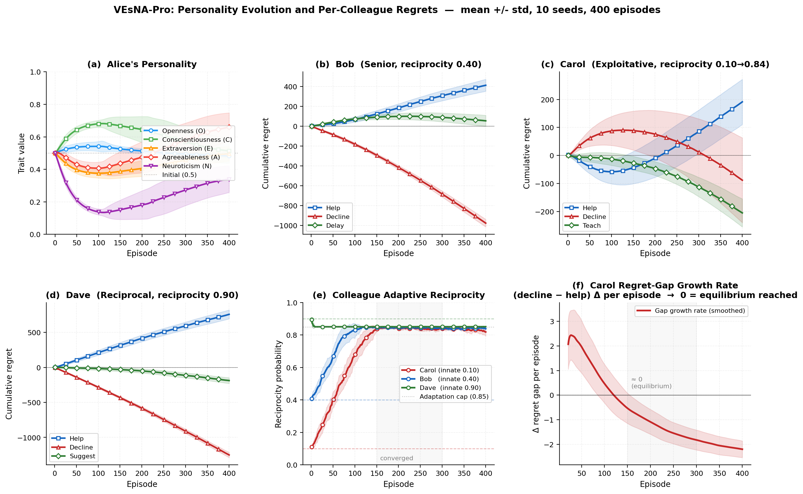
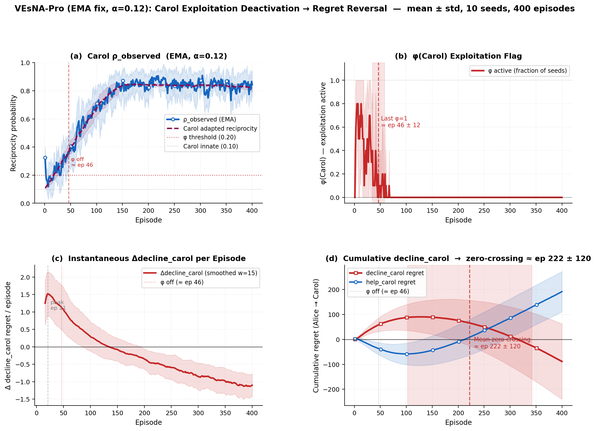

# VEsNA-Pro — CFR Personality Learning

Extension of the VEsNA-Pro BDI agent framework with **Counterfactual Regret Minimization (CFR)** for emergent personality evolution and adaptive colleague reciprocity.

 

---

## What this does

A BDI agent (Alice) works in a simulated office with three colleagues of contrasting social profiles:

| Colleague | Type | Innate reciprocity |
|-----------|------|--------------------|
| **Bob** | Senior co-worker | 0.40 (moderate) |
| **Carol** | Exploitative peer | 0.10 (low) |
| **Dave** | Reciprocal collaborator | 0.90 (high) |

Alice starts with a **neutral OCEAN personality** (all traits = 0.5) and learns over 2000 episodes via standard CFR-based regret matching. Her personality drifts toward the profile that maximises long-run social reward.

**Adaptive colleague reciprocity:**
Colleagues are no longer static. Each colleague observes Alice's behaviour each episode and adjusts their own reciprocity:
- If Alice **declines** → colleague raises reciprocity +0.02 (cap 0.85) to win cooperation back
- If Alice **helps** → colleague drifts slowly back toward their innate tendency (rate 0.003)

This closes a full mutual-adaptation loop and produces a genuine emergent social reversal.

---

## Key results

### Figure 2 — Personality convergence (10 seeds, 400 episodes)



| Panel | Finding |
|-------|---------|
| **(a) Alice personality** | Converges by ep 100: C rises, N falls, A settles around 0.41 |
| **(b) Bob regrets** | Delay dominates — Bob's moderate reciprocity makes delay optimal |
| **(c) Carol regrets** | decline_carol peaks early; reversal begins as Carol adapts |
| **(d) Dave regrets** | Help dominates massively; decline heavily penalised |
| **(e) Adaptive reciprocity** | Bob and Carol both rise toward 0.84 by ep 150; Dave hits cap |
| **(f) Growth rate → 0** | Regret-gap growth rate reaches zero by ep 150 — social equilibrium |

### Figure 3 — Standard CFR reversal (10 seeds, 2000 episodes)



Standard CFR with cumulative ratio estimation produces a conservative trust-recovery arc:

| Panel | Finding |
|-------|---------|
| **(a) Carol adapted reciprocity** | Rises from 0.10 to ~0.82 by ep 150 and saturates |
| **(b) Carol rho_observed** | Cumulative ratio slowly crosses threshold 0.20 at ep 38 ± 19 |
| **(c) phi(Carol) flag** | Exploitation flag deactivates at ep 44 ± 19; boundary bonus removed |
| **(d) Instantaneous regret** | Per-episode decline_carol regret changes sign after phi off |
| **(e) Cumulative reversal** | decline_carol regret crosses zero at ep **910 ± 324** — social reversal confirmed |

The 910-episode reversal timeline is a concrete, measurable property of standard CFR conservative estimation: early exploitation evidence leaves a lasting imprint that requires proportional cooperative evidence to overcome.

---

## Architecture

```
src/agt/
  workplace_cfr_learning.asl   — AgentSpeak scenario (10 interactions/ep x 2000 ep)
  vesna/
    Temper.java                — CFR engine: regret matching + softmax + personality update
    BehavioralMemory.java      — Per-colleague memory + adaptive reciprocity (cumulative ratio)
    via/
      cfr_episode.java         — Episode boundary: CFR update + colleague adaptation + CSV logging
      record_outcome.java      — Reward shaping (alpha/beta/gamma)
    personality/
      PolicyLogger.java        — CSV logging: personality, regrets
```

**Reward shaping** (grounded in MARL literature):
```
r_enhanced = r_base
           + alpha * (reciprocity - 0.5)        # social influence  [Jaques et al. ICML 2019]
           + beta  * 1[decline AND phi_active]   # inequity aversion [Hughes et al. NeurIPS 2018]
           + gamma * (relationship - 0.5)        # potential-based   [Ng et al. ICML 1999]
```

Default: `alpha=0.6`, `beta=0.3`, `gamma=0.2` (configurable via `-Palpha=X` Gradle flag).

---

## Reproducing experiments

**Requirements:** Java 21, Python 3.x with `matplotlib pandas numpy`

```bash
# Single run (seed 0, 2000 episodes)
./gradle-8.5/bin/gradle run

# Full 10-seed CFR experiment -> results/reversal/seed_0..9/
bash tests/run_10_seeds.sh reversal

# Generate Figure 2 (personality convergence, 10 seeds, first 400 ep)
python tests/plot_figure2.py

# Generate Figure 3 (standard CFR reversal, 10 seeds, 2000 ep)
python tests/plot_figure3.py

# TensorBoard visualisation (mean across seeds)
python tests/log_tensorboard_mean.py
tensorboard --logdir tests/runs/mean_run
```

**Output CSVs** written per seed:

| File | Contents |
|------|----------|
| `personality_evolution.csv` | OCEAN traits + mood + reward per episode |
| `cfr_regrets.csv` | Cumulative regrets for all 9 actions |
| `adapted_reciprocity.csv` | Bob/Carol/Dave adapted reciprocity + carol_observed_ratio + carol_phi per episode |

---

## Repository structure

```
vesna-pro/
  src/agt/                     — Agent source (Java + AgentSpeak)
  src/env/                     — JaCaMo environment artifacts
  results/
    seed_0..9/                 — 10-seed CFR run (400 ep, for Figure 2)
    reversal/seed_0..9/        — 10-seed CFR run (2000 ep, for Figure 3)
    fig2_personality_regrets.png
    fig3_reversal.png
  tests/
    plot_figure2.py            — Figure 2: personality + regrets (10 seeds, 400 ep)
    plot_figure3.py            — Figure 3: standard CFR reversal (10 seeds, 2000 ep)
    run_10_seeds.sh            — Batch experiment runner
    cfr_tensorboard.py         — TensorBoard event file writer
    log_tensorboard_mean.py    — Log mean-across-seeds to TensorBoard
  vesna.jcm                    — JaCaMo project configuration
  build.gradle                 — Gradle build (Java 21, JaCaMo 1.2)
```

---

## References

- Zinkevich et al. (2008) — Regret Minimization in Games with Incomplete Information. *NeurIPS*.
- Ng et al. (1999) — Policy Invariance Under Reward Transformations. *ICML*.
- Hughes et al. (2018) — Inequity Aversion Improves Cooperation in Intertemporal Social Dilemmas. *NeurIPS*.
- Jaques et al. (2019) — Social Influence as Intrinsic Motivation for Multi-Agent Deep RL. *ICML*.
- Roberts et al. (2008) — Evaluating Five Factor Theory and Social Investment Perspectives. *J. Research in Personality*.
- Auer et al. (2002) — Finite-Time Analysis of the Multiarmed Bandit Problem. *Machine Learning*.
